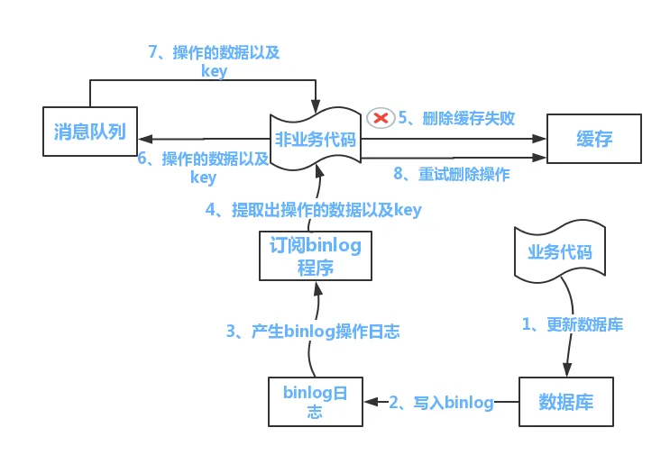

# 缓存一致性
此文主要探讨缓存和数据库的一致性如何保证

# 为什么要缓存
通常数据库我们会做读写分离，但是仅靠此扛住高并发流量还不够，一个MySQL的QPS最多也就几千，如果所有查询流量直接捅到数据库，数据库瞬间就会垮掉，这时我们需要增加缓存，减轻数据库的压力，把99%以上的流量，都挡在数据库外，这样就可以保证数据库不会被大流量打垮，所以缓存也是构建高并发系统中的必不可少的一环。

# 缓存系统遇到的挑战
缓存系统需要保证是高可用的，如果缓存服务器宕机，大量流量会直接捅到数据库，这就是缓存雪崩，这非常危险，再者，缓存数据和DB数据的一致性如何保证的问题

## 缓存的
主节点负责写入，从节点负责读取，因为大部分系统都是读多写少，所以读写分离可以大幅提升系统 QPS承载能力，但是，主从节点间一般是异步复制数据，这期间就会存在数据延迟，如果一致性要求比较高的，可以选择从主节点读取

## 缓存雪崩
缓存雪崩，指的是大量的缓存失效，流量直接达到数据库，数据库承受不了压力崩溃，导致系统整体崩溃的问题。缓存系统需要保证是高可用的，缓存的过期时间可以取个随机值。这么做是为避免缓存同时失效，使得数据库 IO 骤升。比如：以前是设置 10 分钟的超时时间，那每个 Key 都可以随机 8-13 分钟过期，尽量让不同 Key 的过期时间不同。

## 缓存穿透
查询不在数据库里的数据，那肯定也是不在缓存中，这时查询流量会直达数据库，这样的查询请求多了，数据库的压力自然增大，解决方案可以数据库找不到的数据设置空值到缓存，这样下次再请求同个key就不会再打到数据库，这相当于加了些无用的key，为了防止这些key一直存在，也需要加较短的过期时间，另外一个方案是使用布隆过滤器，布隆过滤器在检测数据肯定不存在的场景时，非常合适o

## 缓存击穿
缓存击穿是指，热点数据失效瞬间，大量请求直接访问数据库。例如某些key是热点数据，访问非常频繁。如果某个key失效的瞬间，大量的请求过来，缓存未命中，然后去数据库访问，此时数据库访问量会急剧增加。这时有两个解决方案，一个是使用分布式锁，识别出热点key，这些key永不过期

## 三种缓存模式
### Cache-Aside Pattern
旁路缓存模式，取数据先从缓存读取，读取到数据，直接返回，没有读取到，从数据库加载，写入缓存；更新数据时，先更新数据库，然后删除缓存

## Read-Through/Write-through
读写穿透模型，

## Write-behind

## 更新为什么是删除缓存而不是更新
因为并发写时会出现问题，考虑以下情况：
1.线程A先发起一个写操作，第一步先更新数据库
2.线程B再发起一个写操作，第二步更新了数据库
3.由于网络等原因，线程B先更新了缓存
4.线程A更新缓存。
这时候，缓存保存的是A的数据（老数据），数据库保存的是B的数据（新数据），数据不一致，脏数据出现而且直到下次更新钱不会自动修复。如果是删除缓存取代更新缓存则不会出现这个脏数据问题。而且如果写入的缓存值，是经过复杂计算才得到的话。可能数据还没被读取到，就被更新了，这时提前先计算也浪费了性能

## 更新为什么先操作数据库而不是缓存
因为并发读写时会有问题，考虑以下情况：
1.线程A发起一个写操作，第一步del cache
2.此时线程B发起一个读操作，cache miss
3.线程B继续读DB，读出来一个老数据
4.然后线程B把老数据设置入cache
5.线程A写入DB最新的数据
这时候，缓存保存的是B的数据（老数据），数据库保存的是A的数据（新数据），数据不一致。

## 数据库和缓存的一致性保证
数据库和缓存的是无法保证强一致性，是必然会有不一致的时间窗口存在，我们可以做的是让这个时间窗口尽可能缩小，而不能消除。
有如下两种方案：
1、消息队列做删除重试，当删除缓存失败时，把删除缓存操作插入消息队列，应用再消费这个消息，进行重试，如果再次删除失败，再次插入到消息队列，延迟一段时间后删除缓存，缺点是对业务有感，对业务代码有一定入侵，所以业界一般会优化此方案，也即是方案2
2、读取biglog异步删除缓存

1）更新数据库数据
2）数据库会将操作信息写入BINLOG日志当中
3）订阅程序提取出所需要的数据以及KEY
4）另起一段非业务代码，获得该信息
5）尝试删除缓存操作，发现删除失败
6）将这些信息发送至消息队列
7）重新从消息队列中获得该数据，重试操作。
